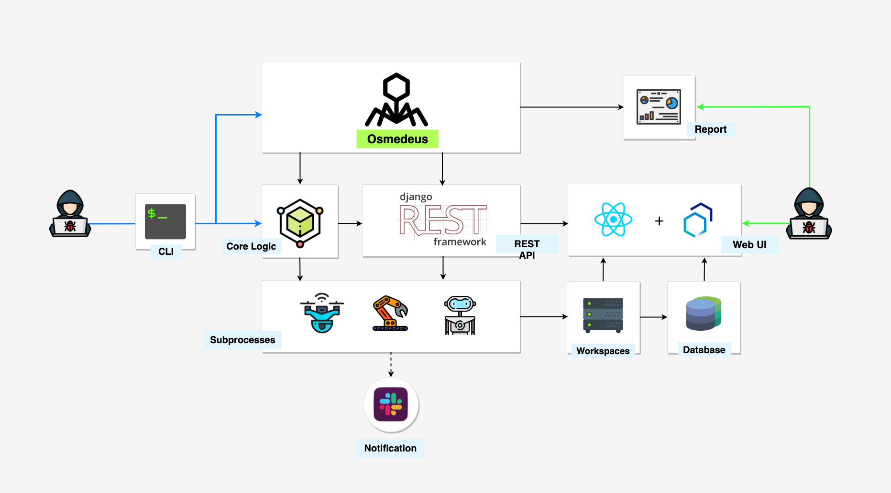
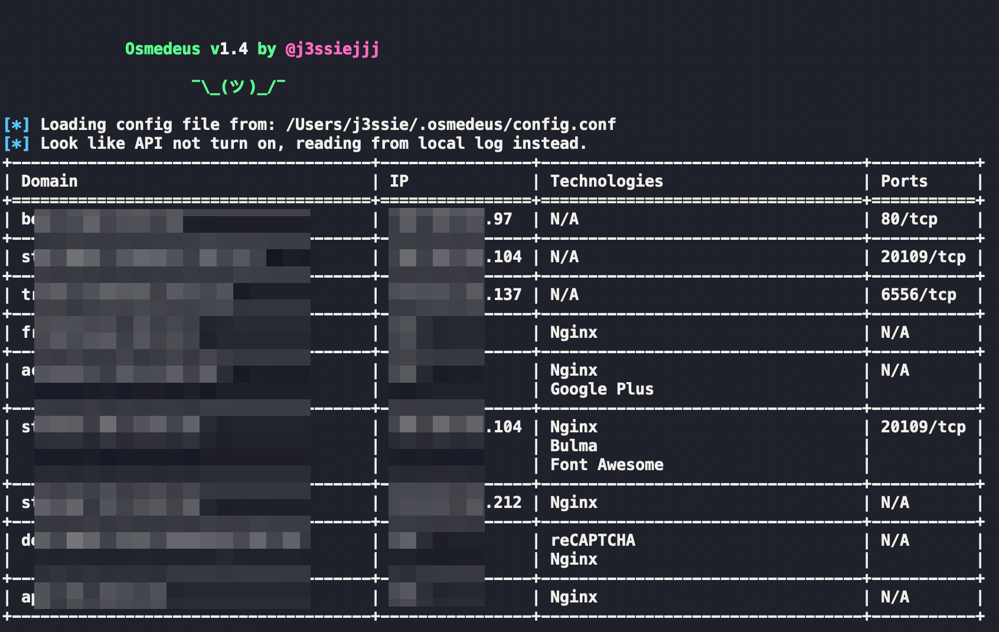
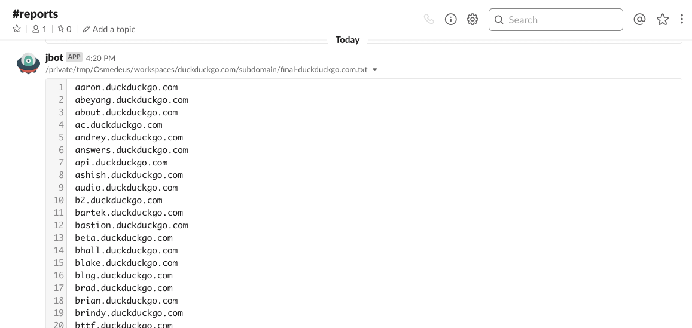
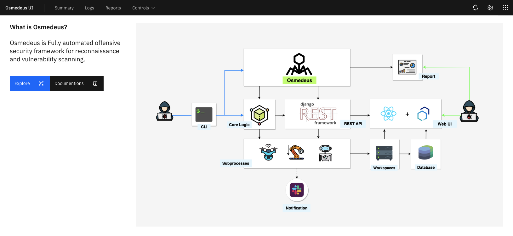
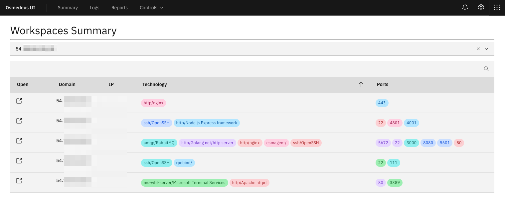

<p align="center">
  
  <p align="center">
    <a href="https://github.com/j3ssie/Osmedeus"></a>
    <a href=""></a>
    <a href=""></a>
    <a href="https://github.com/j3ssie/Osmedeus"></a>
    <a href="https://www.youtube.com/watch?v=kZ-uMC7c5OY&list=PLqpLl_iGMLnA6vbi1ZM-HmWLuedIP2PJl"></a>
  </p>
</p>

## What is Osmedeus?



Osmedeus allows you automated run the collection of awesome tools to reconnaissance and vulnerability scanning against the target.

## Installation

```
git clone https://github.com/j3ssie/Osmedeus
cd Osmedeus
./install.sh
```

This install only focus on Kali linux, check more install on [Usage page](https://j3ssie.github.io/Osmedeus/installation/)

## How to use

If you have no idea what are you doing just type the command below or check out the [Advanced Usage](https://j3ssie.github.io/Osmedeus/advanced/)

```
./osmedeus.py -t example.com
```

## Features

- [x] Subdomain Scan.
- [x] Subdomain TakeOver Scan.
- [x] Screenshot the target.
- [x] Basic recon like Whois, Dig info.
- [x] Web Technology detection.
- [x] IP Discovery.
- [x] CORS Scan.
- [x] SSL Scan.
- [x] Wayback Machine Discovery.
- [x] URL Discovery.
- [x] Headers Scan.
- [x] Port Scan.
- [x] Vulnerable Scan.
- [x] Seperate workspaces to store all scan output and details logging.
- [x] REST API.
- [x] React [Web UI](https://j3ssie.github.io/Osmedeus/web-ui/).
- [x] Support Continuous Scan.
- [x] Slack notifications.
- [x] Easily view [report](https://j3ssie.github.io/Osmedeus/report/) from commnad line.

Check this [Wiki page](https://j3ssie.github.io/Osmedeus/modules/) for more detail about each module.

## Love Osmedeus? Back it!
If you love my tool and would like to support my work. [Become a backer](https://opencollective.com/osmedeus) and you will appear here.
[](https://opencollective.com/osmedeus#backers)

## Demo
[](https://asciinema.org/a/266599)











## Example Commands

```
# normal routine
./osmedeus.py -t example.com

# normal routine but slow speed on subdomain module
./osmedeus.py -t example.com --slow 'all'

# direct mode examples
./osmedeus.py -m portscan -i "1.2.3.4/24"

./osmedeus.py -m portscan -I list_of_targets.txt -t result_folder

./osmedeus.py -m "portscan,vulnscan" -i "1.2.3.4/24" -t result_folder
./osmedeus.py -m "git" -i 'repo:https://github.com/foo/bar'
./osmedeus.py -m "git" -i 'user:sample'

# report mode
./osemdeus.py -t example.com --report list
./osemdeus.py -t example.com --report export
./osemdeus.py -t example.com --report sum
./osemdeus.py -t example.com --report short
./osemdeus.py -t example.com --report full

```


## Disclaimer

Most of this tool done by the authors of the tool that list in [CREDITS.md](https://github.com/j3ssie/Osmedeus/blob/master/CREDITS.md).
I'm just put all the pieces together, plus some extra magic.

This tool is for educational purposes only. You are responsible for your own actions. If you mess something up or break any laws while using this software, it's your fault, and your fault only.

## Credits

Please take a look at [CREDITS.md](https://github.com/j3ssie/Osmedeus/blob/master/CREDITS.md)


## Changelog

Please take a look at [CHANGELOG.md](https://github.com/j3ssie/Osmedeus/blob/master/CHANGELOG.md)


## Contribute

If you have some new idea about this project, issue, feedback or found some valuable tool feel free to open an issue for just DM me via [@j3ssiejjj](https://twitter.com/j3ssiejjj).

## Stargazers over time

[](https://starchart.cc/j3ssie/Osmedeus)
